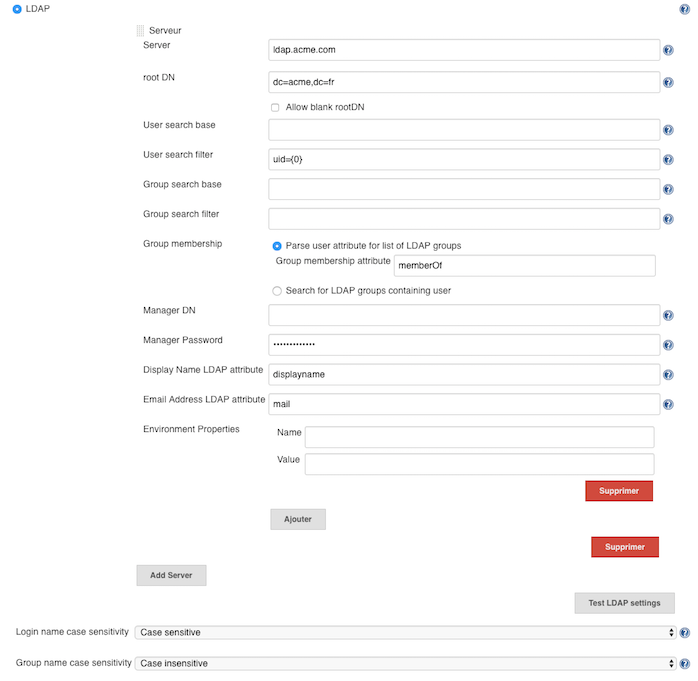

# Jenkins Configuration as Code Plugin


## Introduction

Setting up Jenkins is a complex process, as both Jenkins and it's plugin require some tunning and configuration, 
with dozen parameters to set within the web UI `manage` section. 

Experimented Jenkins users rely on groovy init scripts to customize jenkins and enforce desired state. Those
scripts directly invoke Jenkins API and as such can do everything (at your own risks). But they also require
you know Jenkins internals, and are confident in writing groovy scripts on top of Jenkins API.

Configuration-as-Code plugin has been designed as an _**opinionated**_ way to configure jenkins based on 
human-readable declarative configuration files. Writing such a file should be feasible without being a Jenkins
expert, just translating into _code_ a configuration process one is used to execute in the web UI.

So, we are trying to replace this :



with this :

```yaml
jenkins:

  securityRealm:
    ldap:
      configurations:
        - server: ldap.acme.com
          rootDN: dc=acme,dc=fr
          managerPasswordSecret: ${LDAP_PASSWORD}
      cache:
        size: 100
        ttl: 10
      userIdStrategy: CaseSensitive
      groupIdStrategy: CaseSensitive
```  
  
In addition, we want such a file to have a well documented syntax, and tooling to assist in writing and testing,
so end-users have full guidance in using this toolset and don't have to search stackoverflow for samples. 

## Jenkins Enhancement Proposal 

As Configuration-as-code demonstrated to be a highly requested topic in Jenkins community, we have published
[JEP 201](https://github.com/jenkinsci/jep/tree/master/jep/201) as proposal to make this a standard component
of the Jenkins project.

Current status : proposal accepted.

## Releases

There's no release yet. 

## Examples

Configuration file do include root entries for various components of your jenkins master installation. the `jenkins`
one is for the root jenkins object, and other ones are for various global configuration elements.

```yaml
jenkins:
  securityRealm:
    (...)
  
  nodes:
    slave:
      name: "static-slave"
      remoteFS: "/home/jenkins"
      launcher: "jnlp"
      
  slaveAgentPort: 50000
  agentProtocols:
    - "jnlp2"    
      

git:
  installations:
    - name: git
      home: /usr/local/bin/git

mailer:
  adminAddress: admin@acme.org
  replyToAddress: do-not-reply@acme.org
  smtpHost: smtp.acme.org
  smtpPort: 4441
  
credentials:
  system:
    ? # "global"
    : - certificate:
          scope:    SYSTEM
          id:       ssh_private_key
          keyStoreSource: 
            fileOnMaster:
              keyStoreFile: /docker/secret/id_rsa      
```

Also see [demos](demos) folder with various samples.

## Full documentation

The configuration file format depends on the version of jenkins-core and installed plugins. 
Documentation is generated from a live instance, as well as JSON-schema you can use to validate configuration file
with your favourite yaml tools.

**TODO** provide a dockerfile to 'build' this documentation from specified jenkins-core release and plugins.


## Supported plugins

Here is a list of plugin we have successfuly tested to support configuration-as-code approach :

 - [x] active directory plugin ([details](demos/credentials/README.md))
 - [x] artifactory plugin ([details](demos/artifactory/README.md))
 - [x] credentials plugin ([details](demos/credentials/README.md))
 - [x] docker plugin ([details](demos/docker/README.md))
 - [x] git plugin ([details](demos/git/README.md))
 - [x] ldap plugin ([details](demos/ldap/README.md))
 - [x] mailer plugin with some limitations ([details](demos/mailer/README.md))
 - [x] tfs plugin with some limitations ([details](demos/tfs/README.md))
 - [x] workflow-cps-global-lib _aka_ "global libraries" ([details](demos/workflow-cps-global-lib/README.md))                  
 - [ ] more to come soon... 
